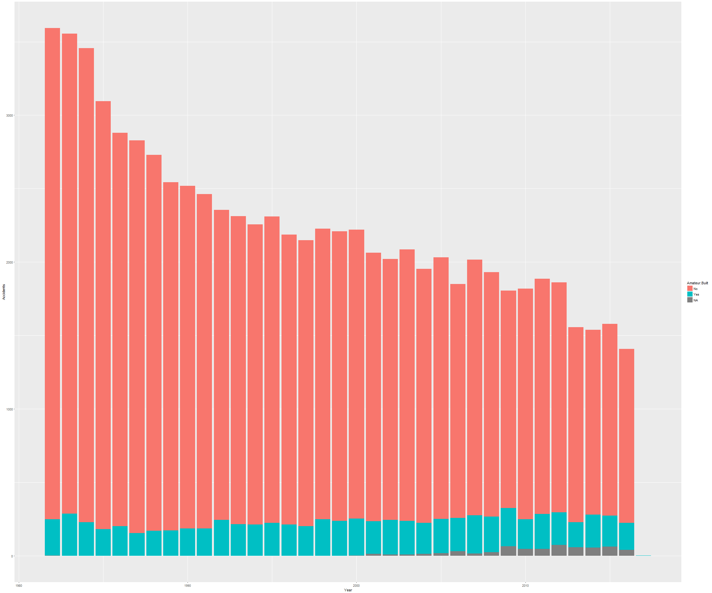

Aviation accident database analyzer
========================================================
author: Pendril Mandril
date: 04 - 02 - 2017
autosize: true

Overview
========================================================

This app will allow us to study interactively the aviation accident database found at www.kaggle.com.

To do so, we can filter the data by several variables such as:

- Date of the event.
- Number of fatal injuries.
- Country where the disaster happend.
- Purpose of the flight.
- Type of aircraft.


Looking at the code
========================================================

First of all, we will load and select the variables of interest.
We build the app using responsive functions.
Here we show how the data is subset when the filters are applied.

```r
library(tidyverse);
library(lubridate);
library(shiny)
flights <- readr::read_csv("AviationDataEnd2016UP.csv")
flights$Year <- year(flights$Event.Date) %>% as.integer()
flights <- select(flights, Total.Fatal.Injuries, Year, Purpose.of.Flight,
                  Aircraft.Damage, Report.Status, Country, Aircraft.Category, Amateur.Built) 
flights$Amateur.Built  <- as.factor(flights$Amateur.Built)

# Filter the flights, returning a data frame

  getFlights <- reactive({
    f <- flights %>% filter(
      Total.Fatal.Injuries > input$fatalInjuries, 
      Year > input$year[1],
      Year < input$year[2]
    )
    if (input$purposeFlight != "All") {
      f <- f %>% filter(Purpose.of.Flight == input$purposeFlight)
    }
    if (input$aircraftDamage != "All") {
      f <- f %>% filter(Aircraft.Damage == input$aircraftDamage)
    }
    if (input$reportStatus != "All") {
      f <- f %>% filter(Report.Status == input$reportStatus)
    }
    if (input$country!= "All" & input$country != "") {
      f <- f %>% filter(Country == input$country)
    }
    if (input$aircraftCategory != "All") {
      f <- f %>% filter(Aircraft.Category == input$aircraftCategory)
    }
    return(f)
  })
```


Example of plot we can get with the app
========================================================



Application
========================================================

To display the understanding of using shiny to build an application, a simple application called Aviation accident database analyzer has been developed and deployed at: https://pendrilmandril.shinyapps.io/aviationdataapp/

The application allows the user to study interactively the aviation accident database found at www.kaggle.com.

Read the source at: https://github.com/PendrilMandril/AviationDataApp
